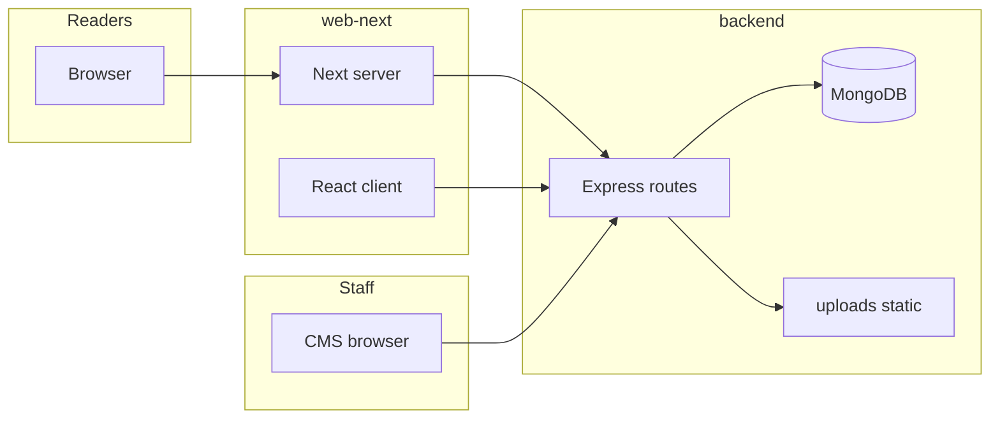

# Kothari News — full-stack architecture reference

This document describes how **web-next** (public site), **backend** (REST API + MongoDB), and **cms** (staff desk) fit together: responsibilities, request flows, data model conventions, and operational concerns. It expands the high-level map in the architecture plan and complements [README.md](../README.md), [web-next/README.md](../web-next/README.md), and [web-next/src/ARCHITECTURE.md](../web-next/src/ARCHITECTURE.md).

---

## 1. Monorepo and technology choices

### 1.1 What lives where

| Package | Runtime | Role |
|---------|---------|------|
| **backend** | Node.js + Express | Single source of truth for articles, videos, users, tasks; JWT auth for staff; static file hosting for uploads. |
| **web-next** | Next.js (App Router) | Public, indexable reader experience: SEO metadata, JSON-LD, server components where possible, client islands for interactivity. |
| **cms** | Vite + React (SPA) | Authenticated workflows for writers, editors, and admins; no SEO requirement; talks to the same API as the public site for mutations. |

The root [package.json](../package.json) only forwards scripts (`dev:web-next`, `dev:cms`, `dev:backend`, etc.). Each app has its own `package.json`, lockfile behavior, and environment files.

### 1.2 Why this split (news product perspective)

- **Separation of concerns**: Editorial workflows (draft → submit → review → publish) and permission logic stay in one API. The public site stays thin: fetch published content, render, cache where appropriate.
- **SEO and crawlability**: Next.js App Router allows `generateMetadata`, canonical URLs, sitemaps, and structured data on the server without exposing CMS routes to crawlers.
- **Bilingual desk model**: Articles carry `primaryLocale` (`hi` | `en`) and parallel fields (`title` / `titleHi`, `body` / `bodyHi`, desk completion flags). Hindi and English stories are **separate documents**, not mechanically linked pairs—simplifies listing, URLs, and permissions while still allowing desk-specific editors (`editor_en`, `editor_hi`).
- **Staff UX vs reader UX**: The CMS can be deployed on a different origin, use heavier editors (TipTap, CKEditor), and long-lived SPA state without affecting Time to First Byte on the homepage.

### 1.3 End-to-end data flow

- **Server-side Next** (RSC / route handlers / `generateMetadata`) calls the API using server-safe URLs ([`INTERNAL_API_URL`](../web-next/README.md), or origin from env).
- **Browser** may call `/api/...` same-origin (dev rewrites) or `NEXT_PUBLIC_API_ORIGIN` in production.
- **CMS** uses axios against the API base URL (Vite dev server proxies `/api` to the backend—see [README](../README.md) quick start).

---

## 2. Backend (Express + Mongoose)

### 2.1 Application entry

[`backend/server.js`](../backend/server.js):

1. Loads `dotenv`, creates Express app.
2. **Production**: `trust proxy` for correct `req.ip` behind PaaS; CORS restricted via `CLIENT_URL` / `CLIENT_URLS`.
3. **Development**: CORS can reflect origins (LAN testing from phones).
4. Connects MongoDB via [`config/db.js`](../backend/config/db.js), then runs [`config/seed.js`](../backend/config/seed.js) (idempotent admin / demo content when appropriate).
5. Middleware: `cors`, `express.json` (10mb cap for rich payloads), `express.urlencoded`.
6. **Static**: `GET /uploads/*` from disk `backend/uploads`.
7. Mounts routers under `/api/*` (see below).
8. Health: `GET /api/health`.
9. 404 JSON + global error handler.

### 2.2 Route modules (surface area)

| Mount path | File | Typical consumers |
|------------|------|---------------------|
| `/api/auth` | `routes/auth.js` | CMS login, password flows; issues JWT. |
| `/api/articles` | `routes/articles.js` | CMS writers/editors: CRUD, submit, publish, image upload, assignments. Uses `authenticate` + `authorize` + role helpers from `middleware/auth.js` and `utils/roles.js`. |
| `/api/editor` | `routes/editor.js` | Editor desk metrics/lists without admin-only endpoints. |
| `/api/admin` | `routes/admin.js` | User/task administration, destructive operations where allowed. |
| `/api/public` | `routes/public.js` | **No auth** — web-next home, category, article, breaking ticker, search, newsletter signup, etc. |
| `/api/reader` | `routes/reader.js` | Reader account features (bookmarks, likes, preferences) when JWT reader auth is used from web-next. |
| `/api/tasks` | `routes/tasks.js` | Task board linking optional `Task.article` references. |
| `/api/videos` | `routes/videos.js` | YouTube metadata management; public list is via `/api/public/videos`. |

### 2.3 Public API behavior (locale)

[`public.js`](../backend/routes/public.js) applies `locale` query parameters:

- `locale=hi` → filter `primaryLocale: "hi"`.
- `locale=en` → English plus legacy documents with null/missing locale (migration compatibility).

Endpoints include (non-exhaustive): published article lists with pagination, single published article resolution (by id / slug / article number patterns), breaking list, search, videos list, newsletter-related routes where implemented.

### 2.4 Article model and workflow

[`models/Article.js`](../backend/models/Article.js) encodes:

- **Status**: `draft` → `submitted` → `published` or `rejected` (back to draft for edits).
- **primaryLocale**: drives which title/body/meta fields are authoritative for read time calculation in `pre('save')`.
- **articleNumber**: unique 9-digit public identifier; auto-generated if absent on save.
- **slug**: unique, sparse; used in canonical public URLs.
- **Desk fields**: `writerEn`, `writerHi`, `editorEn`, `editorHi`, `enDeskComplete`, `hiDeskComplete` for bilingual workflow.
- **Images**: embedded subdocuments with `url`, `caption`, `isHero`, `alt`, `imageTitle`, `imageDescription`, `source`, dimensions.
- **Publishing metadata**: `publishedAt`, `publishedBy`, `views`, `upvotes`, etc.

[`routes/articles.js`](../backend/routes/articles.js) contains server-side validation aligned with CMS rules: primary content presence, image metadata completeness for publish paths, hero normalization via **Sharp** on upload, slug rules, and role-scoped updates (writers constrained to their assignments and locale, editors/admins broader).

### 2.5 Auth model (staff)

JWT is issued on successful login; protected routes use middleware to verify token and attach user. Role enums align between backend [`utils/roles.js`](../backend/utils/roles.js) and CMS [`cms/src/constants/roles.js`](../cms/src/constants/roles.js) (writer_en / writer_hi, editor_en / editor_hi, editor, admin, super_admin, video_editor).

### 2.6 Scripts and maintenance

[`backend/package.json`](../backend/package.json) documents operational scripts, for example:

- `articles:clear` — delete all articles (does not touch users/videos).
- `seed:articles`, `seed:news-40`, `seed:news-200` — controlled reseeding (the 200-article script clears articles and unlinks tasks, then inserts 100 EN + 100 HI published rows).
- Migrations: `migrate:primary-locale`, `migrate:article-numbers`, `migrate:bilingual-assignments`, etc.

Always run destructive scripts against the correct `MONGO_URI` in `backend/.env`.

---

## 3. web-next (Next.js App Router)

### 3.1 Architectural principles

[`web-next/src/ARCHITECTURE.md`](../web-next/src/ARCHITECTURE.md) defines boundaries:

- **Route files** (`app/**/page.tsx`): metadata, `generateMetadata`, server data fetch, composition—avoid client hooks in highly indexable pages.
- **Features** (`features/*`): domain modules (home, category, article, shows, profile, legal, auth) with `components/`, `hooks/`, `server/`, `seo/`, `types/`, `utils/`.
- **Services** (`services/`): API adapters shared by server and client.
- **Lib** (`lib/`): server-safe helpers (`serverPublicApi`, `serverApiOrigin`, SEO builders, locale helpers).

### 3.2 Talking to the API

- **[`config/publicApi.ts`](../web-next/src/config/publicApi.ts)**: Resolves `NEXT_PUBLIC_API_ORIGIN`; strips loopback absolute URLs on LAN clients so `/api` rewrites work on phones.
- **[`services/newsApi.ts`](../web-next/src/services/newsApi.ts)**: Typed `fetch` helpers for `/api/public/*` (articles, breaking, search, videos) with `withPublicOrigin` for absolute upload URLs when needed.
- **[`lib/serverPublicApi.ts`](../web-next/src/lib/serverPublicApi.ts)**: Server-side fetch for metadata and JSON-LD (uses internal origin when configured).

[`next.config.ts`](../web-next/next.config.ts) (see web-next README): in local dev, rewrites `/api` and `/uploads` to the backend port (default 5050).

### 3.3 Major routes (reader)

| URL area | Purpose |
|----------|---------|
| `/` | Home: server-fetched rails from published articles + mixed locale behavior where configured. |
| `/category/[slug]` | Category grid + metadata + collection JSON-LD. |
| `/article/[id]` | Article detail: dynamic metadata, `NewsArticle` schema, hero/body, related strip. |
| `/shows` | Published videos listing. |
| `/profile`, `/login`, `/register` | Reader profile and auth (Google client id env). |
| Legal | `/privacy`, `/cookies`, `/terms` — static/shell patterns. |

Sitemap and robots are implemented under `app/` per Next conventions.

### 3.4 Home and feeds

Home composition pulls from the public articles API (and videos where used). Category rails and “latest” behavior are driven by shared services such as [`services/homeFeed.ts`](../web-next/src/services/homeFeed.ts) and feature modules under `features/home/`. Infinite scroll or mixed-order strips (when present) consume the same published API with pagination.

### 3.5 SEO

Each major indexable route coordinates:

- `metadata` / `generateMetadata` using server-fetched headline/dek.
- JSON-LD builders under `features/*/seo/schema.ts`.
- Canonical and Open Graph URLs using `NEXT_PUBLIC_SITE_URL`.

---

## 4. CMS (Vite + React Router)

### 4.1 Bootstrap

- [`cms/src/main.jsx`](../cms/src/main.jsx): mounts React root, wraps `BrowserRouter` and providers.
- [`cms/src/App.jsx`](../cms/src/App.jsx): route table and role gates.

### 4.2 Authentication shell

[`cms/src/context/AuthContext.jsx`](../cms/src/context/AuthContext.jsx) holds the logged-in user, token lifecycle, and axios defaults pointing at `/api`. [`ProtectedRoute.jsx`](../cms/src/components/ProtectedRoute.jsx) wraps routes that require login and optionally specific role groups.

### 4.3 Route map (functional areas)

| Path pattern | Audience | Purpose |
|--------------|----------|---------|
| `/login`, `/forgot-password` | Public | Staff authentication. |
| `/writer`, `/writer/new`, `/writer/edit/:id` | Writers | Dashboard and article editor. |
| `/editor`, `/editor/queue`, `/editor/review/:id`, … | Editors (+ admins) | Queues, review, articles list, writers (read-only), tasks read-only, videos for video staff. |
| `/admin/*` | Admin / super_admin | Full user/task/video/writer admin. |

Role home redirect sends users to the correct default desk ([`RoleHome` in App.jsx](../cms/src/App.jsx)).

### 4.4 Rich content editing

Writers and editors use rich text components ([`RichTextEditor.jsx`](../cms/src/components/RichTextEditor.jsx) and related) producing HTML stored in `body` / `bodyHi`. Image uploads hit backend upload endpoints; URLs may be absolute to the API host—web-next normalizes loopback URLs for readers on LAN via `withPublicOrigin`.

### 4.5 Alignment with API rules

The CMS mirrors backend constraints (required image metadata, desk completion flags, submit vs publish). Divergence would show up as 400 responses from `routes/articles.js`—keep CMS validation messages aligned when changing rules.

---

## 5. Cross-cutting concerns

### 5.1 CORS

Production backends must list allowed browser origins (`CLIENT_URL` or comma-separated `CLIENT_URLS`) for the deployed **web-next** and **cms** sites. Misconfiguration manifests as blocked `fetch` from the browser—not server-to-server Next metadata fetches (those originate from the Node server).

### 5.2 Environment variables (mental model)

| App | Typical variables |
|-----|-------------------|
| **backend** | `MONGO_URI`, `PORT`, `JWT_SECRET`, `CLIENT_URL(S)`, `NODE_ENV`, email keys if used, newsletter keys if used. |
| **web-next** | `NEXT_PUBLIC_SITE_URL`, `NEXT_PUBLIC_API_ORIGIN`, `NEXT_PUBLIC_GOOGLE_CLIENT_ID`, optional `INTERNAL_API_URL`. |
| **cms** | Vite `VITE_*` for API base and site origin for preview links (see CMS env patterns in code). |

### 5.3 Media

Uploaded images live under `backend/uploads` and are served at `/uploads/...`. Hero images may be normalized to a fixed aspect via Sharp in the articles route.

### 5.4 Deployment

See root [DEPLOY.md](../DEPLOY.md) and [RENDER.md](../RENDER.md) for split hosting (e.g. API on Render/Railway, Next on Vercel, CMS on a second Vercel project or internal host). Ensure:

- API CORS matches real origins.
- Next public env points to the public API URL when not same-origin.
- MongoDB Atlas network access allows the API host.

### 5.5 Consistency checklist when changing behavior

1. **Schema** — Update Mongoose model and any migration script.
2. **API** — Update public + authenticated routes and validation.
3. **CMS** — Update forms, role visibility, and client validation.
4. **web-next** — Update types in `newsApi.ts`, formatters, and any SEO/description fields.
5. **Seeds** — Update `config/seed.js` or standalone scripts if demo data must reflect new fields.

---

## 6. Related documentation

- [README.md](../README.md) — quick start, role table, public API list.
- [web-next/README.md](../web-next/README.md) — env, rewrites, connectivity check.
- [web-next/src/ARCHITECTURE.md](../web-next/src/ARCHITECTURE.md) — front-end feature layout and SEO checklist.
- [DEPLOY.md](../DEPLOY.md), [RENDER.md](../RENDER.md) — hosting.

This file is the **monorepo-wide** narrative; keep it updated when you add major routes, roles, or deployment steps.
